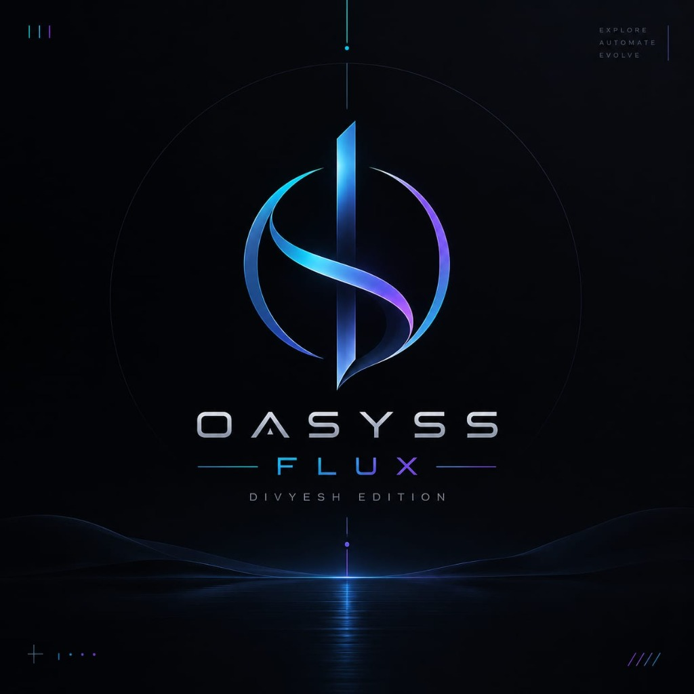

# Oasyss Flux (Divyesh Edition)

<div align="center">



### **The Stealth Overlay & AI Companion for Online Interviews & Coding Assessments**
*Bypass screen sharing. Zero tab-switch alerts. Instant AI syntax & code clutch.*
*Now cleanly separated into dedicated **Windows** and **macOS** packages.*

[](#-windows-edition-oasyss-flux-windows)
[](#-macos-edition-oasyss-flux-macos)
[](#-key-features)
[](#-downloads--quick-start)
[](LICENSE)

</div>

---

## ⚠️ DISCLAIMER: NOT FOR THE TEXTBOOK PURISTS

> [!WARNING]
> **If you're the textbook purist who memorizes 500 LeetCode problems line-by-line and believes in suffering through 45-minute silent panics... close this tab, this repo is not for you.**
>
> This tool is engineered for candidates, developers, and students facing high-stakes online coding tests, technical assessments, and live virtual interviews. When you're stuck on a tricky syntax bug, forgotten API method, or nasty edge case—Oasyss Flux is your invisible safety net. *Smart work over blind stress, full jugaad.*

---

## 🎯 The Problem It Solves

Modern online technical hiring and proctored coding assessments have ruthless monitoring:
1. **Screen Sharing is Enforced**: Interviewers on Zoom, Google Meet, Microsoft Teams, or Webex watch your entire desktop.
2. **Tab-Switch Trackers**: Platforms like HackerRank, Mercer Mettl, Codility, and test portals track when you leave the window or press Alt+Tab / Cmd+Tab, flagging you for "suspicious activity".

### How Oasyss Flux Solves This:
- **Invisible to Screen Share**: 
  - **Windows**: Uses native Win32 `WDA_EXCLUDEFROMCAPTURE`.
  - **macOS**: Uses native Quartz compositor `NSWindowSharingNone`.
  - The interviewer sees only your clean IDE or coding portal. Oasyss Flux simply does not exist on their screen feed or in screen recordings.
- **Zero Tab Switching**: The embedded browser and AI drawer float directly *over* your test window. You never Alt+Tab away, meaning test proctoring scripts never detect any focus loss or tab switches.
- **Instant AI Debugging**: Need a quick regex pattern, algorithmic hint, or time-complexity sanity check? Slide out the AI drawer, get the answer, and close it in seconds.

---

## 📂 Repository Organization

The repository is cleanly divided into two dedicated, independent operating system directories:

```
oasyss-flux/
├── oasyss-flux-windows/                 # 🪟 Windows 10/11 WPF (.NET 8) Application
│   ├── Release/
│   │   └── Oasyss Flux.exe              # Standalone pre-built executable (~83 MB)
│   ├── MyOverlayPOC.sln                 # Visual Studio Solution
│   ├── MyOverlayPOC.csproj              # .NET 8 Project file
│   ├── MainWindow.xaml / .cs            # Stealth overlay UI, tabs & ghost mode
│   ├── DisplayAffinityManager.cs        # WDA_EXCLUDEFROMCAPTURE engine
│   ├── SecureStorageHelper.cs           # Windows DPAPI encryption
│   ├── AiChatService.cs                 # Multi-model AI client (Gemini, Groq, OpenAI)
│   └── README.md                        # Windows-specific documentation & build guide
│
├── oasyss-flux-macos/                   # 🍏 macOS Universal 2 (Apple Silicon + Intel) Application
│   ├── core/                            # Shared core engine, session state & AI services
│   ├── platform/macos/                  # NSWindowSharingNone & Keychain adapters
│   ├── ui/                              # Hardened Electron UI & preload bridge
│   ├── assets/macos/                    # AppIcon.icns, Info.plist & Swift helpers
│   ├── scripts/                         # Universal packaging (ARM64 + x64) & DMG scripts
│   ├── tests/                           # Core subsystem & static bundle test suites
│   ├── docs/                            # Checklists, signing guide & release manifests
│   └── README.md                        # macOS-specific documentation & build guide
│
├── .github/workflows/build-macos.yml    # Automated 8-stage macOS CI/CD pipeline
├── README.md                            # Main project overview & index
└── LICENSE                              # GNU General Public License v3.0
```

---

## 📥 Downloads & Quick Start

Pata hai interview se pehle SDKs install karne ka tension nahi lena hota. Pre-compiled, standalone release packages are ready to download:

### 🪟 Windows Edition ([`oasyss-flux-windows/`](oasyss-flux-windows/))

1. Go directly to **[`oasyss-flux-windows/Release/`](oasyss-flux-windows/Release/)**.
2. Download [**`Oasyss Flux.exe`**](oasyss-flux-windows/Release/Oasyss%20Flux.exe).
3. Double-click **`Oasyss Flux.exe`**.
4. *Bas, khel khatam!* No installation wizard, no .NET SDK needed (~83 MB self-contained).

### 🍏 macOS Edition ([`oasyss-flux-macos/`](oasyss-flux-macos/))

Universal 2 binary for **Apple Silicon (M1/M2/M3/M4)** and **Intel (x86_64)**:

| Artifact | Architecture | Download Link |
| :--- | :--- | :--- |
| **`Oasyss Flux — macOS Universal.dmg`** | Universal 2 (`arm64` + `x86_64`) | [**Download via GitHub Actions Artifacts**](https://github.com/divyesh8/oasyss-flux/actions/runs/35506874748/artifacts/10604406146) |
| **`Oasyss Flux — macOS Universal.zip`** | Universal 2 (`arm64` + `x86_64`) | [**Download via GitHub Actions Artifacts**](https://github.com/divyesh8/oasyss-flux/actions/runs/35506874748/artifacts/10604406146) |

#### 🛠️ macOS Setup:
1. **Mount & Install**: Open the DMG and drag **`Oasyss Flux.app`** to **`/Applications`**.
2. **Official Security & Gatekeeper Verification**:
   - Production releases are signed with an Apple Developer ID certificate and notarized by Apple.
   - For local unsigned development builds, macOS Gatekeeper verifies the application package via standard system dialogs. Open via Finder (`Control-click` → `Open`).
3. **Permissions**: Enable **Screen Recording** in `System Settings → Privacy & Security → Screen Recording` to allow display compositor capture exclusion verification.

---

## 🔥 Key Features

### 👻 Capture Exclusion & Screen-Share Invisibility
- **Windows**: Win32 `WDA_EXCLUDEFROMCAPTURE` API.
- **macOS**: Native Quartz compositor `NSWindowSharingNone`.
- Attempts to exclude this window from supported screen capture mechanisms (such as Zoom, Teams, Meet, Discord, and desktop screen recorders).
- The interviewer only sees your IDE and coding platform underneath. *Note: Operating system compositor-level protection does not guard against physical hardware capture cards or external recording devices.*

### 🪟 Complete Transparency & Click-Through Ghost Mode
- **100% Invisible & Click-Through**: Instantly make the entire overlay completely transparent and click-through.
- **Shortcuts**:
  - **macOS**: <kbd>Shift</kbd> + <kbd>⌘ Cmd</kbd> + <kbd>T</kbd>
  - **Windows**: <kbd>Shift</kbd> + <kbd>T</kbd> (or <kbd>Shift</kbd> + <kbd>Alt</kbd> + <kbd>T</kbd>)
- Mouse clicks pass straight through the overlay directly into your active IDE or coding test as if nothing is there. Press the shortcut again to restore.

### 🌐 Embedded Sandboxed Web Browser
- Built-in multi-tab web browser that floats over your test environment.
- Tab strip, URL address bar, Back / Forward / Reload controls, bookmarks, and global audio muting.
- Securely sandboxed with strict Content Security Policy (CSP) and navigation lockdown.

### 🤖 Multi-Model AI Assistant Drawer
- Integrated slide-out assistant powered by your own API keys:
  - **Google Gemini**: Fast, intelligent reasoning (`gemini-2.5-flash`, `gemini-1.5-flash`).
  - **Groq Cloud**: Lightning-speed inference with `llama-3.1-70b` for instant code responses without waiting.
  - **OpenAI ChatGPT**: Industry-standard code explanations (`gpt-4o`, `gpt-4o-mini`).
- Keys are encrypted with **macOS Keychain** or **Windows DPAPI**.

---

## ⌨️ Keyboard Shortcuts Reference

| macOS Shortcut | Windows Shortcut | Action |
|---|---|---|
| <kbd>Shift</kbd> + <kbd>⌘</kbd> + <kbd>T</kbd> | <kbd>Shift</kbd> + <kbd>T</kbd> | **Ghost Mode**: Toggle Click-Through & Transparency |
| <kbd>⌘</kbd> + <kbd>K</kbd> | <kbd>Ctrl</kbd> + <kbd>K</kbd> | **Command Palette**: Quick Search & Actions |
| <kbd>⌘</kbd> + <kbd>,</kbd> | <kbd>Ctrl</kbd> + <kbd>,</kbd> | Open Settings |
| <kbd>⌘</kbd> + <kbd>1</kbd> - <kbd>4</kbd> | <kbd>Ctrl</kbd> + <kbd>1</kbd> - <kbd>4</kbd> | Switch Workspaces |
| <kbd>⌘</kbd> + <kbd>T</kbd> | <kbd>Ctrl</kbd> + <kbd>T</kbd> | Open New Browser Tab |
| <kbd>⌘</kbd> + <kbd>W</kbd> | <kbd>Ctrl</kbd> + <kbd>W</kbd> | Close Active Tab |
| <kbd>⌘</kbd> + <kbd>R</kbd> | <kbd>Ctrl</kbd> + <kbd>R</kbd> / <kbd>F5</kbd> | Refresh Web Page |
| <kbd>⌘</kbd> + <kbd>Q</kbd> | <kbd>Alt</kbd> + <kbd>F4</kbd> | Quit Oasyss Flux |

---

## 🔐 Cryptographic Checksums (SHA-256)

Verified release hashes from macOS CI runner:

```text
29ef9bbfa1d35daabd0fefdd90954983f1d6f59c20483e9d4616a10395d87d2a  Oasyss Flux — macOS Universal.dmg
00381b5ce689f4918f44b2a38e45437e8bb3f2041aebee9a320e6736420b7bc0  Oasyss Flux — macOS Universal.zip
75a7fc4d0cb5392ad2ae68e82ef7eaeb6d5b00c6d71b4020c78a0f5d470d0fd8  assets/macos/AppIcon.icns
```

---

## 🛠️ For Developers (Build from Source)

### Building the Windows Edition:
```powershell
cd oasyss-flux-windows
dotnet restore
dotnet build -c Release
dotnet publish -c Release -r win-x64 --self-contained true -p:PublishSingleFile=true -p:EnableCompressionInSingleFile=true -p:IncludeNativeLibrariesForSelfExtract=true -p:IncludeAllContentForSelfExtract=true -p:AssemblyName="Oasyss Flux" -o ./Release
```

### Building the macOS Edition:
```bash
cd oasyss-flux-macos
npm install
npm test
npm run compile:helpers
npm run build:mac
npm run package:dmg
```

---

## 📄 License & Attribution

Distributed under the **GNU General Public License v3.0** (GPL-3.0). See [LICENSE](LICENSE) for details.

<br/>

<div align="center">

**If this saved your technical round or coding assessment, don't forget to drop a ⭐ on this repo!**

</div>
