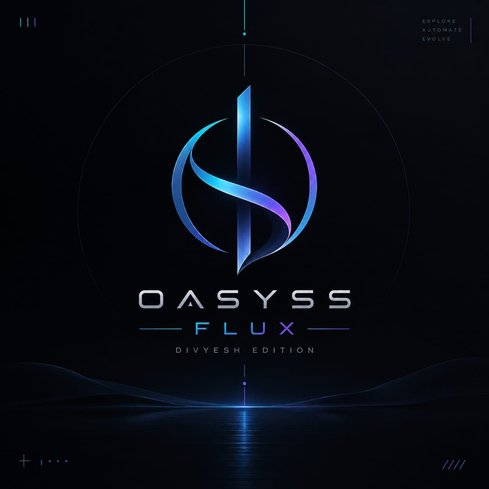

# Oasyss Flux (Evadus Lite)

<div align="center">



### **The Stealth Overlay & AI Companion for Online Interviews & Coding Exams**
*Bypass screen sharing. Zero tab-switch alerts. Google Lens 1-click visual analysis. Instant AI syntax & code clutch.*

[](https://microsoft.com/windows)
[](#-ghost-mode--screen-share-invisibility)
[](#-google-lens-1-click-screen-capture--visual-analysis)
[](#-quick-start-zero-setup-needed)
[](#-disclaimer-not-for-the-textbook-purists)
[](LICENSE)

</div>

---

## ⚠️ DISCLAIMER: NOT FOR THE TEXTBOOK PURISTS

> [!WARNING]
> **If you're the textbook purist who memorizes 500 LeetCode problems line-by-line and believes in suffering through 45-minute silent panics... close this tab, this repo is not for you.**
>
> This tool is engineered for candidates, developers, and students facing high-stakes online coding tests, technical assessments, and live virtual interviews. When you're stuck on a tricky syntax bug, forgotten API method, or nasty edge case—Oasyss Flux is your invisible safety net. *Smart work over blind stress, full jugaad.*

---

## 🎯 The Problem It Solves

Modern online technical hiring and proctored coding assessments enforce strict surveillance:
1. **Screen Sharing is Enforced**: Interviewers on Zoom, Google Meet, or Microsoft Teams watch your desktop.
2. **Tab-Switch Trackers**: Platforms like HackerRank, Mercer Mettl, Codility, and test portals track when you leave the window or press Alt+Tab, flagging you for "suspicious activity".

### How Oasyss Flux Solves This:
- **Invisible to Screen Share**: Uses native Windows API (`WDA_EXCLUDEFROMCAPTURE`). The interviewer sees only your clean IDE or coding portal. Oasyss Flux does not appear on their screen feed or in recordings.
- **Zero Tab Switching**: The browser and AI companion float directly *over* your test window. You never Alt+Tab away, meaning test proctoring scripts never detect any focus loss or tab switches.
- **Instant Browser Mode**: Shift into a native Google Chrome disguise (<kbd>Shift</kbd> + <kbd>B</kbd>) with zero tab-switching alerts and full web capabilities.
- **Google Lens Vision Analysis**: Capture your entire screen with 1 click (<kbd>Shift</kbd> + <kbd>L</kbd>), ask your doubts directly from the screenshot, and get instant answers in your companion window.
- **Multi-Model AI Intelligence**: Backed by the latest models (Gemini 2.5 Flash, GPT-4o, DeepSeek R1 Distill, Claude 3.5 Sonnet) with zero-key instant web knowledge fallback.

---

## 🔥 Key Features

### 📷 Google Lens (1-Click Screen Capture & Visual Analysis)
- **1-Click Whole Screen Capture**: Press <kbd>Shift</kbd> + <kbd>L</kbd> or click the camera icon (`📷`) in the Chrome top bar, Omnibox, or AI input bar.
- **Direct Visual Doubt Resolution**: Takes a 100% native monitor resolution capture and automatically attaches it to your chat input. Type your doubt (e.g. *"Solve question 3"*, *"What does this error mean?"*, *"Explain this code"*) and press Enter.
- **Multimodal AI Vision & Native Windows OCR**: Transmits the screenshot directly to multimodal AI models (`gpt-4o`, `gemini-2.5-flash`) while simultaneously running local offline Windows OCR (`Windows.Media.Ocr.OcrEngine`) for 100% character-level reading accuracy.
- **Zero API Key Requirement**: Runs completely out of the box with zero setup. If no API key is configured, it extracts the problem text from the screenshot using local OCR, queries real-time web knowledge, and answers your doubt accurately.
- **In-Tab Answers**: Responses are delivered cleanly **inside the AI Companion Tab only**—no intrusive browser tabs opened.
- **Clipboard Sync**: The full-resolution screenshot is automatically copied to your Windows clipboard, ready for instant paste (`Ctrl + V`) into Google Images if desired.

### 👻 Ghost Mode (Screen-Share Invisibility)
- Uses Windows low-level display affinity (`WDA_EXCLUDEFROMCAPTURE`).
- Works across **Zoom, Google Meet, Microsoft Teams, Discord, OBS, and desktop screen recorders**.
- Screen share me window bilkul gayab—the person viewing your screen only sees your IDE and coding platform underneath.

### 🌐 Native Browser Mode Disguise (`Shift + B`)
- Seamlessly transforms the interface into a Google Chrome browser disguise with clean tab controls, URL bar, navigation buttons, and an isolated WebView2 runtime.
- Spoofs window title to `Google Chrome` and switches application icon to the official Chrome icon.
- Browse documentation, StackOverflow, or API specs directly on top of your coding test without triggering any "Tab Switch", "Window Blur", or "Focus Loss" detection.
- Press <kbd>Shift</kbd> + <kbd>B</kbd> anytime to toggle back to the Cyber Flux Dashboard.

### 🤖 Latest Multi-Model AI Engine
Equipped with the newest state-of-the-art LLMs and multimodal vision reasoning models:
- **Google Gemini**: `gemini-2.5-flash` (flagship multimodal), `gemini-2.5-pro` (deep reasoning), `gemini-2.0-flash`, `gemini-1.5-flash`.
- **OpenAI ChatGPT**: `gpt-4o` (omni multimodal), `gpt-4o-mini`, `o3-mini`, `o1`, `o1-mini`, `chatgpt-4o-latest`.
- **Groq Cloud**: Lightning-fast inference with `llama-3.3-70b-versatile`, `deepseek-r1-distill-llama-70b` (DeepSeek reasoning!), `llama-3.1-8b-instant`, `qwen/qwen3.8-27b`, `openai/gpt-oss-120b`.
- **Anthropic Claude**: `claude-3-5-sonnet-20241022`, `claude-3-5-haiku-20241022`, `claude-3-opus-20240229`.
- **Zero-Key Web Knowledge Fallback**: If no API keys are entered, queries real-time instant web answers, Wikipedia summaries, and search snippets so the chat is never broken.

### 🎨 Authentic Chrome Dark Theme & Polished UI
- Fully restyled to match modern Google Chrome dark mode aesthetics (`#202124` / `#292A2D`).
- High-contrast, custom-styled dropdown selectors with dark backdrops and crisp text visibility—no white box cutouts or illegible labels.
- Dedicated attachment bars with thumbnail previews, pill action buttons, and clear badges.

### ⚡ Panic Key (`Shift + Alt + Z`)
- If you need the overlay gone in a split second, press <kbd>Shift</kbd> + <kbd>Alt</kbd> + <kbd>Z</kbd>.
- The entire window instantly vanishes from your sight. Press it again to bring it right back.

### 🪟 Complete Transparency & Ghost Mode (`Shift + T` / `Shift + Alt + T`)
- Instantly make the entire overlay **100% transparent (invisible) and click-through**.
- All mouse clicks pass directly through to your IDE or coding test underneath as if the overlay is not even there.
- Press <kbd>Shift</kbd> + <kbd>T</kbd> (or <kbd>Shift</kbd> + <kbd>Alt</kbd> + <kbd>T</kbd>) again to instantly restore opacity and interaction.
- Also includes a floating opacity slider for customizable semi-transparent reading.

### 🔇 1-Click Audio Silence (Global Mute)
- Instant mute button to kill all audio across all tabs. No surprise sound leaks during live rounds.

### 📸 Problem Statement Snapshot Tray
- Grab quick snapshots of complex question diagrams, constraints, or input/output formats with the built-in screenshot tool. Saved directly to a dock tray for easy reference.

---

## 🚀 Quick Start (Zero Setup Needed)

Pata hai interview se pehle SDKs install karne ka tension nahi lena hota. That's why everything is compiled into **ONE clean standalone `.exe` file** in the **[`Release/`](Release/)** directory:

### 📥 1-Click Launch:
1. Open the **[`Release/`](Release/)** folder in this repository (or `oasyss-flux-windows/Release/`).
2. Double-click [**`Oasyss Flux.exe`**](Release/Oasyss%20Flux.exe).
3. *Bas, khel khatam!* The application launches instantly with full stealth, browser, and AI capabilities.

> [!TIP]
> **Pure 1-File Executable — Zero Dependencies or Runtime Installers.**
> All runtime components, native dependencies, icons, and media are embedded directly inside the single `.exe` (~83 MB). You can copy this single `.exe` file anywhere (Desktop, USB drive, etc.) and launch it directly without needing any other files, runtimes, or .NET installations!

---

## ⌨️ Essential Keyboard Shortcuts

| Shortcut | Action |
|---|---|
| <kbd>Shift</kbd> + <kbd>B</kbd> | **Toggle Browser Mode**: Switch between Google Chrome disguise & Flux Dashboard |
| <kbd>Shift</kbd> + <kbd>L</kbd> | **Google Lens**: 1-Click Whole Screen Capture & Ask AI Doubts |
| <kbd>Shift</kbd> + <kbd>T</kbd> / <kbd>Shift</kbd> + <kbd>Alt</kbd> + <kbd>T</kbd> | **Complete Transparency**: 100% Invisible & Click-Through Toggle |
| <kbd>Shift</kbd> + <kbd>Alt</kbd> + <kbd>Z</kbd> | **Panic Toggle**: Instant Show / Hide Overlay |
| <kbd>Shift</kbd> + <kbd>Alt</kbd> + <kbd>C</kbd> | Minimize / Restore Overlay to Micro-Dock |
| <kbd>Shift</kbd> + <kbd>Alt</kbd> + <kbd>W</kbd>/<kbd>A</kbd>/<kbd>S</kbd>/<kbd>D</kbd> | Move Overlay Window Position |
| <kbd>Shift</kbd> + <kbd>Alt</kbd> + <kbd>Up</kbd>/<kbd>Down</kbd> | Resize Overlay Window Size |
| <kbd>Ctrl</kbd> + <kbd>T</kbd> | Open New Browser Tab |
| <kbd>Ctrl</kbd> + <kbd>W</kbd> | Close Active Tab |
| <kbd>Ctrl</kbd> + <kbd>R</kbd> / <kbd>F5</kbd> | Refresh Web Page |
| <kbd>Esc</kbd> | Dismiss AI Drawer / Settings Modal |

---

## 🔑 AI Key Setup (Optional - Works Out of the Box!)

Google Lens and the AI companion work completely free out of the box with zero API keys required. If you want full conversational generative AI reasoning with models like GPT-4o or Gemini 2.5 Pro:

1. Click the **Settings** (⚙️) gear icon on the top title bar of the AI window.
2. Add your API key:
   - **Google Gemini**: Get a free API key at [Google AI Studio](https://aistudio.google.com/apikey) *(Recommended: generous free tier)*.
   - **Groq Cloud**: Get a free ultra-fast key at [Groq Console](https://console.groq.com/keys) *(Fastest responses for live coding, includes DeepSeek R1!)*.
   - **OpenAI**: Get your API key from [OpenAI Platform](https://platform.openai.com/api-keys).
   - **Anthropic**: Get your key from [Anthropic Console](https://console.anthropic.com/).
3. All keys are encrypted using Windows DPAPI bound to your current Windows user account for maximum local security.

---

## 🛠️ For Developers (Build from Source)

If you wish to modify the code or inspect the implementation:

```powershell
# Prerequisites: .NET 8.0 SDK installed
dotnet restore
dotnet build -c Release

# Run in Release mode
dotnet run -c Release

# To compile the exact standalone single-file executable:
dotnet publish MyOverlayPOC.csproj -c Release
```

---

## 📂 Project Structure

```
oasyss-flux/
├── Release/
│   └── Oasyss Flux.exe       # Standalone 1-file executable (pure single-file launch)
├── AiChatService.cs          # Multi-provider AI brain (Gemini, ChatGPT, Groq, Claude)
├── AiChatWindow.xaml / .cs   # AI companion drawer & Google Lens interface
├── WebSearchHelper.cs        # Zero-API-key web search & instant knowledge engine
├── MainWindow.xaml / .cs     # Win32 ghost hooks, Browser Mode, WebView2 tabs, opacity
├── App.xaml / App.xaml.cs    # Application entry point & lifecycle
├── AssemblyInfo.cs           # Assembly metadata
├── DisplayAffinityManager.cs # WDA_EXCLUDEFROMCAPTURE screen-share invisibility
├── SecureStorageHelper.cs    # Windows DPAPI encrypted credential storage
├── TaskbarManager.cs         # Stealth taskbar hiding & Chrome spoofing
├── WebViewDropForwarder.cs   # Tab drag-and-drop forwarder
├── MyOverlayPOC.csproj       # .NET 8 single-file embedded WPF project
├── MyOverlayPOC.sln          # Visual Studio solution file
├── README.md                 # Complete documentation
├── LICENSE                   # GPL-3.0 License
└── Assets / Resources        # App icons, audio indicators, intro media
```

---

## 📜 License

Distributed under the **GNU General Public License v3.0** (GPL-3.0). See [LICENSE](LICENSE) for details.

---

<div align="center">

**Built for candidates and coders who believe in smart work over panic. Interview clear karo, tension mat lo. Zero scene, pure clutch.**

<br/>

**If this saved your technical round or coding exam, don't forget to drop a ⭐ on this repo!**

</div>
